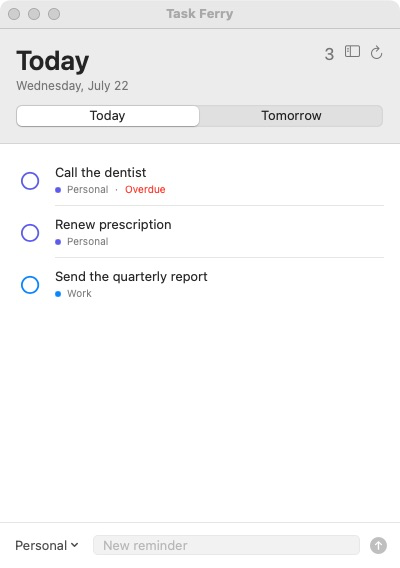
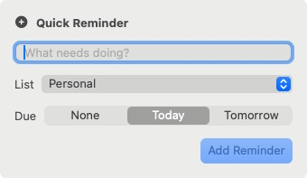

# Task Ferry

A small, private Mac app that ferries Apple Reminders between your personal and work Macs. The same binary runs in either role:

## Screenshots

<p align="center">
  
  <br>
  
</p>

- **Bridge** on the personal Mac mini: reads and writes Reminders with EventKit and serves one authenticated loopback endpoint.
- **Remote client** on the work Mac: shows Today, Tomorrow, lists, reminders, and due dates through a Cloudflare Tunnel.

There is no hosted database, web frontend, or Task Ferry account system. Apple Reminders remains the source of truth. Direct-distribution builds include Sparkle for signed automatic updates and the official `cloudflared` connector for private remote access.

The bundled `cloudflared` executable is distributed under its Apache License 2.0; its license is included in the app bundle.

## Architecture

```text
Work Mac app
  │ HTTPS + Cloudflare service token + bridge bearer token
  ▼
Cloudflare Access → Cloudflare Tunnel
                         │ HTTP on the same Mac only
                         ▼
                  127.0.0.1:8788/v1/rpc
                         │ EventKit
                         ▼
                  Apple Reminders / iCloud
```

Every mutation returns a complete authoritative snapshot. Due dates are transferred as calendar components, rather than absolute timestamps, so a date-only reminder stays date-only across time zones.

## Build and test

Requirements: macOS 14 or newer, Xcode, and [XcodeGen](https://github.com/yonaskolb/XcodeGen). Run `scripts/fetch-cloudflared.sh` before a local app build to prepare the pinned, checksum-verified universal connector; release builds do this automatically.

```sh
brew install xcodegen
scripts/fetch-cloudflared.sh
xcodegen generate
DEVELOPER_DIR=/Applications/Xcode.app/Contents/Developer xcodebuild build \
  -project TaskFerry.xcodeproj \
  -scheme TaskFerry \
  -configuration Debug \
  -destination 'platform=macOS,arch=arm64' \
  -derivedDataPath .derivedData \
  CODE_SIGN_STYLE=Manual CODE_SIGN_IDENTITY=- CODE_SIGNING_REQUIRED=YES
```

Run the host-independent core tests with `scripts/test.sh`. The same command is used by CI and every release build.

For the safe sample UI used during development:

```sh
TASK_FERRY_DEMO=1 .derivedData/Build/Products/Debug/TaskFerry.app/Contents/MacOS/TaskFerry
```

Demo mode is in-memory and never requests Reminders access. Set `TASK_FERRY_DEMO_ROLE=bridge` to verify the bridge UI safely.

## Personal setup

### 1. Personal Mac mini

1. Build and launch the app, then choose **Share this Mac's reminders**.
2. Select **Allow Reminders Access** and approve the macOS Reminders permission.
3. In Settings, select **Set Up with Cloudflare**.
4. Sign in to your own Cloudflare account in the browser, choose an active domain, and choose a subdomain. Task Ferry creates its tunnel, DNS record, Access application, and service token automatically.
5. Enable launch at login and keep the app running. The bridge still listens only on `127.0.0.1:8788`; it is not reachable from the LAN.

### 2. Cloudflare

This remains a bring-your-own-Cloudflare design. Task Ferry neither proxies through a service owned by the developer nor receives the user's Cloudflare credentials.

The browser flow uses Cloudflare OAuth Authorization Code with PKCE. The user chooses the Cloudflare account and approves limited permissions. Task Ferry uses that short-lived authorization to create only:

- one remotely managed Tunnel whose origin is `http://127.0.0.1:8788`;
- one proxied CNAME for the hostname the user chose;
- one Access service token and one self-hosted Access application restricted to that hostname.

The OAuth access token is revoked after provisioning and is never stored. The tunnel token and Access client secret are stored in the macOS Keychain. The bundled connector receives its tunnel token only in its process environment and disables self-updates; signed Task Ferry updates own connector updates. Removing the Cloudflare setup reauthorizes, deletes the exact recorded resources in the user's account, and leaves unrelated resources alone.

The selected Cloudflare account must already have [Zero Trust](https://developers.cloudflare.com/cloudflare-one/setup/) activated; the free plan is sufficient. It must also have at least one active domain. Task Ferry refuses to replace an existing DNS record.

Cloudflare Access and the bridge bearer token remain independent authentication layers. Task Ferry sends Cloudflare's documented `CF-Access-Client-Id` and `CF-Access-Client-Secret` headers on remote requests; see [Cloudflare service tokens](https://developers.cloudflare.com/cloudflare-one/access-controls/service-credentials/service-tokens/).

### 3. Work Mac

1. Install the signed app and choose **Connect to my Mac mini**.
2. On the bridge Mac, select **Copy Connection Code**. Treat this code like a password because it contains all three connection credentials.
3. Send the code securely to the work Mac, select **Paste Connection Code** in Settings, and then select **Save & Test**. Task Ferry rejects non-HTTPS remote endpoints.
4. Enable launch at login if desired.

Secrets are stored in the macOS Keychain. Network requests use an ephemeral URL session with caching disabled.

## Scope

The current app intentionally supports only:

- writable reminder lists: create, rename, delete;
- incomplete reminders: create, edit, complete, delete;
- date-only and timed due dates;
- Today (including overdue) and Tomorrow;
- a menu-bar quick entry with list selection and None, Today, or Tomorrow due dates.

It intentionally omits notes, tags, priorities, recurrence, attachments, shared-list administration, completed-history browsing, offline writes, and conflict merging. Since each change is immediately applied to EventKit and followed by a fresh snapshot, there is no second task database to reconcile.

## Distribution

Task Ferry is a regular Mac app with a main window, standard application menu, and a focused menu-bar quick-entry form on remote clients. A bridge can optionally run in the background without a Dock icon; reopening Task Ferry from Applications restores its window.

The `Release-Direct` configuration follows the MenuMines direct-distribution pattern: Hardened Runtime, Developer ID signing, Apple notarization, a drag-to-Applications DMG, and EdDSA-signed Sparkle updates. Debug and ordinary Release builds remain sandboxed; the direct build is not sandboxed so Sparkle can replace the installed app cleanly.

Create releases with:

```sh
APPLE_TEAM_ID=YOUR_TEAM_ID \
scripts/release.sh 0.1.0
```

The script uses the `TaskFerry` notarization profile and the Sparkle private key in the login Keychain. It produces a versioned DMG, a stable `TaskFerry.dmg`, an update ZIP, and `appcast.xml` under `build/release/`.

The included GitHub Actions workflow publishes those four files when a `v*` tag is pushed. It requires these repository secrets:

- `DEVELOPER_ID_CERT_BASE64`
- `DEVELOPER_ID_CERT_PASSWORD`
- `APPLE_ID`
- `APPLE_ID_PASSWORD` (an app-specific password)
- `APPLE_TEAM_ID`
- `SPARKLE_PRIVATE_KEY`

Task Ferry includes its public Cloudflare OAuth client ID in the app build. The client uses `http://127.0.0.1:8789/cloudflare/oauth` as its redirect URI and these least-privilege scopes: `argotunnel.write` (Cloudflare Tunnel Write), `dns.write` (DNS Write), `zone-access.write` (zone-scoped Access Apps and Policies Write), `access-service-token.write` (Access Service Tokens Write), and `zone.read` (Zone Read). Task Ferry opens the authorization page in the user's browser, receives the one-time response on that loopback-only address, verifies PKCE and `state`, and then stops listening. It always includes exactly that scope set in its authorization request. Cloudflare requires domain verification before a client can be made public. The client ID is public configuration, not a secret.

Sparkle's `generate_keys` tool stores the private update key in the login Keychain. Export it once with `generate_keys -x <temporary-file>`, copy it directly into the `SPARKLE_PRIVATE_KEY` repository secret, and remove the temporary file immediately.

The release repository must be publicly readable so a corporate Mac can download the DMG and Sparkle appcast without GitHub credentials. The Developer ID certificate and notarization credentials are the only pieces that cannot be created from source code.

## License

Copyright © 2026 MeriMeriMeri Software. Task Ferry is licensed under the [GNU Affero General Public License v3.0 only](LICENSE). Distributed modifications—and modified versions offered to users over a network—must make their corresponding source available under the same license. The license does not permit relicensing Task Ferry as a closed proprietary product.
